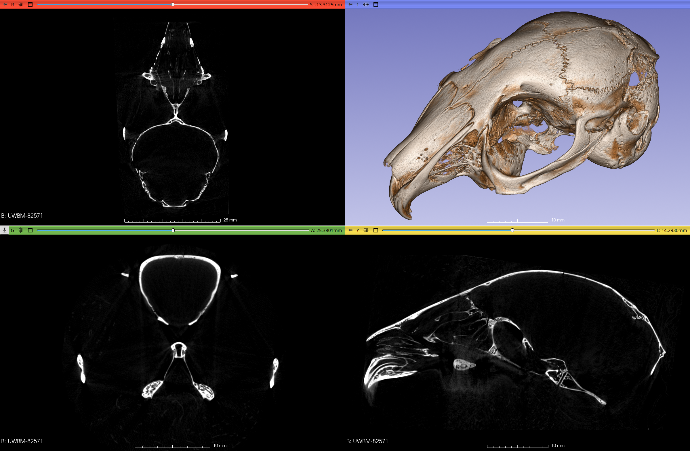

## MorphoDepot Repository
Repository for segmentation of a specimen scan.  See [this JSON file](MorphoDepotAccession.json) for specimen details.
* Species: Brachylagus idahoensis
* Accessioned specimen: UWBM:Mamm:82571 ([record](https://gbif.org/occurrence/1702720731))
* Modality: Micro CT (or synchrotron)
* Contrast: No
* Dimensions: (688, 1189, 605)
* Spacing (mm): (0.047500999999999995, 0.04750100000000001, 0.047501)

## Screenshots

_Pygmy rabbit_

<!-- MORPHODEPOT-DOI:START -->
## Citation & DOI

**Cite this release:**

> Maga, A. Murat (2026). MorphoDepot/brachylagus-idahoensis-skull — MorphoDepot segmentation dataset (v1) [Data set]. Zenodo. https://doi.org/10.5281/zenodo.21420112

To cite *all* versions (always resolves to the latest), use the concept DOI: <https://doi.org/10.5281/zenodo.21420111>

*(This block is regenerated on every release — the version DOI above changes each time.)*
<!-- MORPHODEPOT-DOI:END -->
